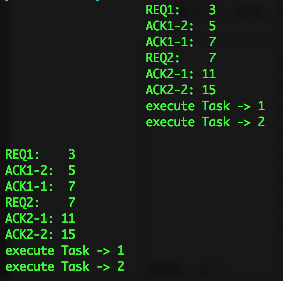

# sync
distribute system homework synchronize

## What's this?
Lamport の論理クロックを応用した全順序マルチキャストを実装せよ.
ただし，リクエスト/レスポンスを行うクライアントは2個としてよい.
また，各クライアントが送信するリクエストは各1つと仮定してよい.
以下の実行例のように，2つのプロセスで同じ順番でリクエストを処理できていること.
なお，実装言語は問わないが，2つのプロセスは独立に動作させること.

なお，Processではなく，Threadでいい模様...

## コンパイル方法
- 必要なし

## 実行方法
`./exec`

## 実行のスクリーンショット

## 苦労(工夫)した点
- 時間がなくて工夫できなかった
- 仮定が多すぎて定数ばかりつかってしまった．
- 工夫するならClientの数を変えられるようにしたい
- あとProcess/Threadを使わずに複数PCでできるようにしたい
- Javaで初めてThread間通信をした
    - 共有クラスを作ってsynchonizeで排他制御
    - これやるならキューを排他制御しても同じかなって思いました○
- とりあえずひどいプログラムになったので，後でリファクタリングします
